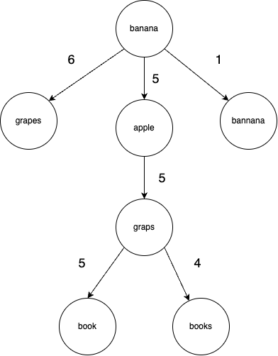

# BK-Tree for Approximate String Matching
## Overview
This repository contains a Python implementation of a BK-tree (Burkhard-Keller tree), a data structure designed for efficient approximate string matching. The BK-tree is useful for applications such as spell checking, autocorrection, and fuzzy searching.




## Features
- **Insertion**: Add words to the BK-tree efficiently.
- **Suggestions**: Retrieve suggestions for a given word based on a specified maximum edit distance.

## Getting Started
### Prerequisites
- Python 3.x
### Usage

```python
from bk_tree import BKTree

# Create a BK-tree with a maximum edit distance of 1
spellingTree = BKTree(1)

# Insert words into the BK-tree
spellingTree.insert("banana")
spellingTree.insert("grapes")
spellingTree.insert("apple")
spellingTree.insert("bannana")
spellingTree.insert("graps")
spellingTree.insert("aple")
spellingTree.insert("cake")
spellingTree.insert("book")
spellingTree.insert("books")

# Get suggestions for a given word
suggestions = spellingTree.suggest("boog")
print("Suggestions:", suggestions)
```
### Visualization
You can visualize the structure of the BK-tree using the `print_tree` function:
```
spellingTree.print_tree()
```
This will print the tree structure along with the edit distances.
### TODO:
- add the edit distance in the visualization

### Acknowledgements
The BK-tree algorithm is based on the Burkhard-Keller tree, introduced by Walter A. Burkhard and Robert M. Keller.
